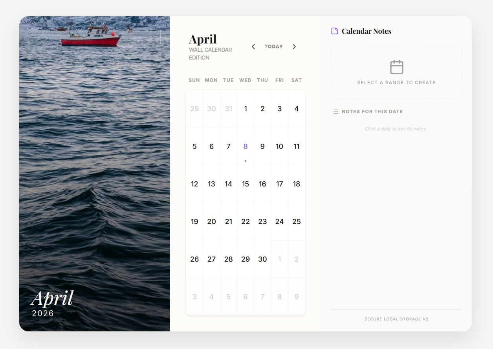
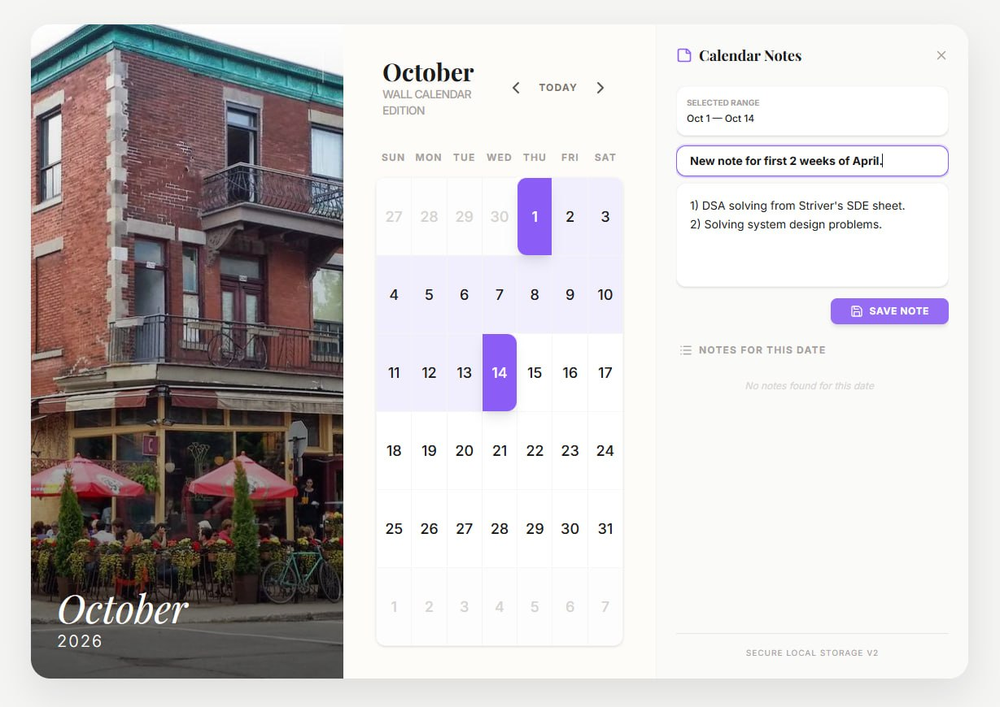
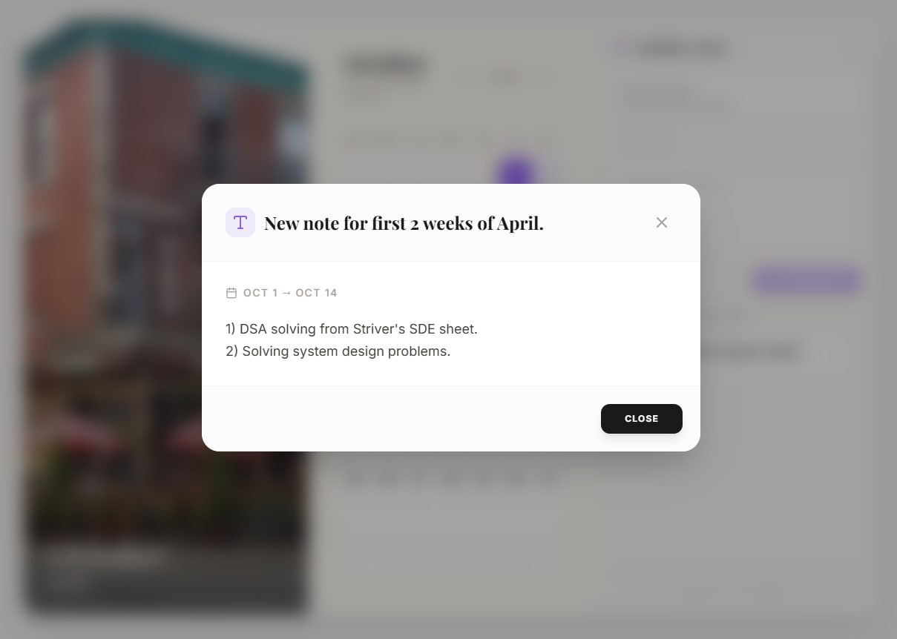

# 📅 Interactive Wall Calendar Component

A premium, interactive calendar inspired by real-world wall calendars, crafted with a strong focus on :-
✨ intuitive UX
⚡ performance
🧩 clean frontend architecture.
Designed to deliver a seamless planning experience with elegant visuals and smooth interactions.

---

## 🚀 Live Demo

👉 https://tuf-calendar-zr77-ajlwueqo9-parijat-ghoshs-projects.vercel.app/

---

## 🎥 Demo Video

👉 https://drive.google.com/file/d/1jUMSF3kxMs1E9uPvGCUw5LQN8ucZSx6_/view

---

## ⚡ Key Impacts

| Metric            | Achievement                                               |
| ----------------- | --------------------------------------------------------- |
| UX Responsiveness | Smooth interactions with instant visual feedback          |
| State Efficiency  | Optimized React state to avoid unnecessary re-renders     |
| Persistence       | 100% client-side note retention via localStorage          |
| Responsiveness    | Fully functional across desktop & mobile devices          |
| Interaction Flow  | Reduced user friction with intuitive date-range selection |

---

## 🎯 Problem It Solves & Impact

Traditional calendar UIs are either:

* ❌ Static (no interactivity)
* ❌ Cluttered and hard to use
* ❌ Lack contextual note-taking

This solution introduces:

* **Seamless date range selection** → simplifies planning workflows
* **Integrated note system** → reduces context switching
* **Persistent client-side storage** → ensures data availability without backend
* **Clean visual hierarchy** → improves usability and reduces cognitive load

👉 Designed to mimic real-world usability while enhancing digital interaction.

---

## 🖼️ UI Preview



*Calendar overview, this is the user interface*


*Creation of new notes with a range of dates*


*Retrival of notes which are saved in the local storage of the browser*

---

## ✨ Key Features

### 📆 Interactive Date Range Selection

* Click-based start → end selection
* Dynamic in-range highlighting
* Intelligent reset behavior

---

### 📝 Persistent Notes System

* Notes mapped to selected date ranges
* Structured input:

  * Title
  * Content
* Auto-fetch on re-selection
* Stored using **localStorage**

---

### 🎨 Wall Calendar UI

* Hero image-driven layout
* Balanced visual hierarchy
* Minimal, modern design system

---

### 📱 Fully Responsive

* Desktop → multi-panel layout
* Mobile → stacked UI
* Touch-friendly interactions

---

### ✨ UX Enhancements

* Smooth animations (Framer Motion)
* Hover + click feedback
* Modal-based note viewing
* Clear empty states

---

## 🛠 Tech Stack

| Layer      | Technology    |
| ---------- | ------------- |
| Frontend   | React (Vite)  |
| Language   | TypeScript    |
| Styling    | Tailwind CSS  |
| Animations | Framer Motion |
| Storage    | localStorage  |

---

## 🧱 Architecture Overview

```bash
/src
  /components
    CalendarGrid.tsx
    DayCell.tsx
    Header.tsx
    ImageSection.tsx
    NotesPanel.tsx
    NoteModal.tsx
  /assets
  App.tsx
  main.tsx
  utils.ts
  types.ts
```

---

## ⚙️ Core Logic

### 📆 Date Range Selection

* First click → start date
* Second click → end date
* Intermediate dates auto-calculated
* Hover preview support

---

### 💾 Notes Storage Model

```json
{
  "2026-01-05_to_2026-01-10": {
    "title": "Trip",
    "content": "Goa trip with friends"
  }
}
```

* Key-based mapping for quick retrieval
* Fully client-side persistence
* No backend dependency

---

## 🎯 Engineering Decisions

* Used **localStorage** to align with frontend-only scope
* Modular component structure for maintainability
* Clean separation of concerns
* Minimal dependencies → better performance
* Focused on UX-first implementation

---

## 🧪 Running Locally

```bash
git clone https://github.com/Parijat-Ghosh/TUF_calendar
cd TUF_calendar/calendar
npm install
npm run dev
```

---

## 📌 Future Enhancements

* Calendar cell note indicators
* Dark / Light theme
* Drag-to-select range
* Holiday markers
* Backend sync (cloud storage)

---

## 🙌 Acknowledgment

Built as part of a frontend engineering challenge by takeUforward.

---

## 📬 Contact

* **Parijat Ghosh**
* GitHub: https://github.com/Parijat-Ghosh

---

⭐ If you found this project interesting, consider giving it a star!
